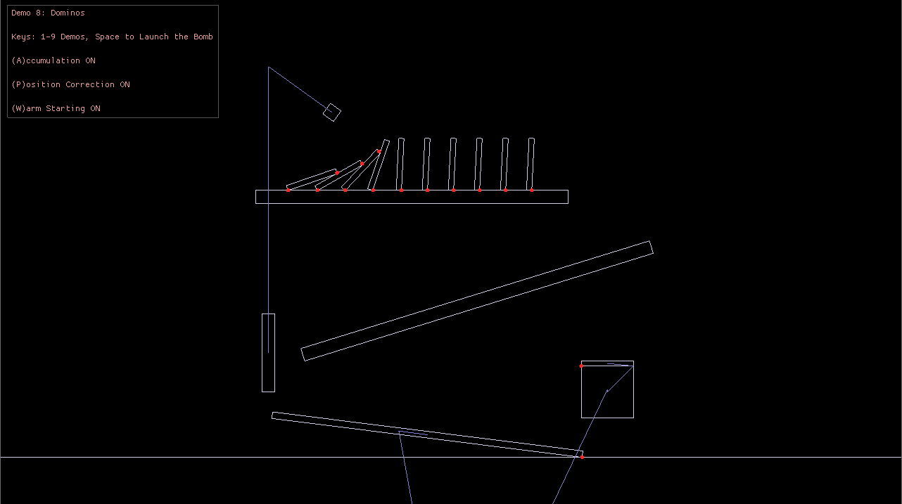

# Box2D-Lite in GDScript

This is a GDScript port of
[Box2D-Lite](https://github.com/erincatto/box2d-lite) library: a small 2D
physics engine written by Erin Catto. Compatible with
[Godot Engine](https://godotengine.org/) 3.x.

As the name suggests, this is not a full rewrite of the larger
[Box2D](https://box2d.org/) library in GDScript, but the original version of
Box2D which is mostly suitable for learning purposes.



## Usage

1. Clone the repository:
   ```
   git clone https://github.com/Xrayez/box2d-lite-gdscript
   ```
2. Import the project via [Godot Engine](https://godotengine.org/)'s project
   manager and run it.
3. Run the demos by pressing <kbd>F5</kbd>. Use keyboard keys `1-9` to switch
   from one demo to another.

## Differences

The port is mostly equivalent to
[Box2D-Lite](https://github.com/erincatto/box2d-lite), with `World`, `Box`,
`Joint` classes all extending `Node2D` (they are prefixed with `Box2D` name in
GDScript), see [`src/`](src/) directory. Collision code is merged into
`arbiter.gd`, otherwise this would produce cyclic reference errors in
GDScript.

All demos are also ported from the original C++ implementation with little to no
changes, see [`samples/main.gd`](samples/main.gd).

### Coordinate system

Unlike in Godot, the positive Y axis points *up* in Box2D-Lite. Therefore, some
constants like gravity are converted so that positive Y axis points *down*.

### Performance

Because GDScript is dynamically typed, some demos may be extremely slow to run
compared to original implementation written in C++ (namely
`Demo 5: Pyramid Stacking`). The bottleneck also comes from the simplified
broad-phase algorithm in Box2D-Lite which uses brute-force O(n^2)
implementation. Due to this, this port also implements basic spatial
partitioning using a grid for the broad-phase stage alongside the original
implementation (enabled by default).

Depending on the complexity, better algorithms could be implemented in the
future, but not in a way which would make the existing implementation no longer
"lite". In any case, this is an opportunity for you to implement collision
checking algorithms for learning purposes for your own needs, which is the
direct reason why this port exists in the first place!

# License

Unless otherwise specified, all files in this repository are released under the
[MIT license](LICENSE.txt).

The [Box2D-Lite](https://github.com/erincatto/box2d-lite) library from which
this port was created is available under the MIT license by Erin Catto (not
distributed in this repository), see [COPYRIGHT.txt](COPYRIGHT.txt).

The logo image [logo.png](logo.png) is copyright of Erin Catto.

The project uses `ProggyClean.ttf` font to render informational panel used by
the original Box2D-Lite drawing library released under MIT license, see
[COPYRIGHT.txt](COPYRIGHT.txt).
